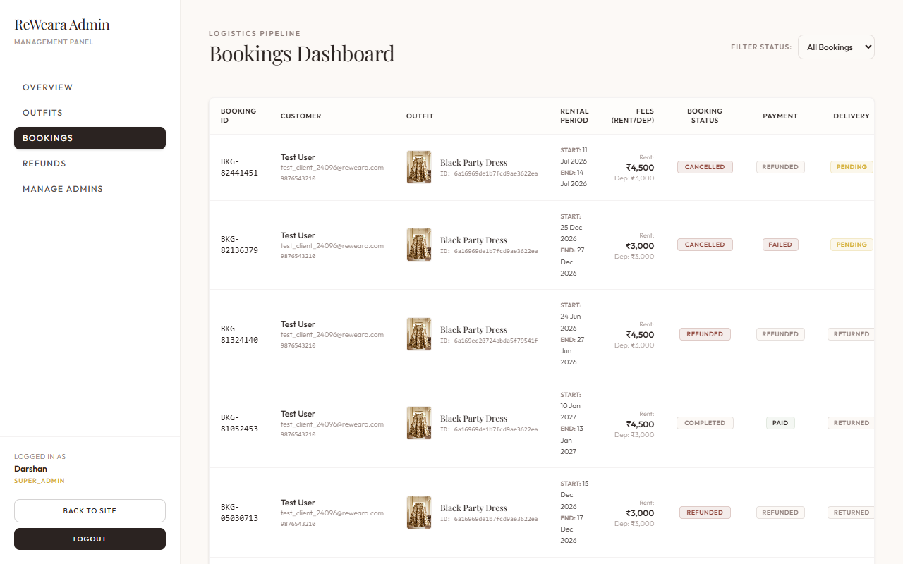
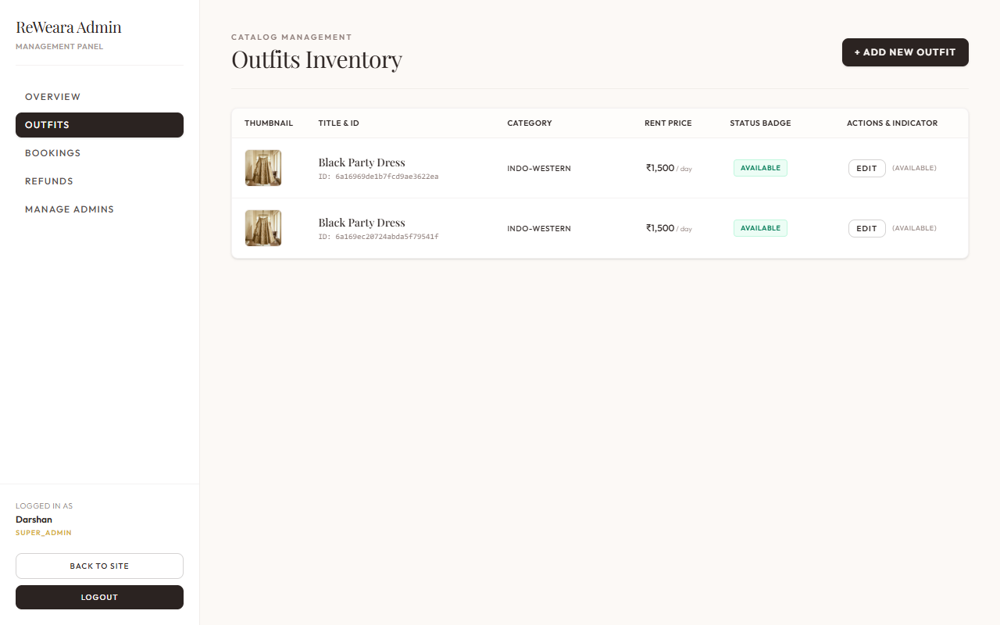
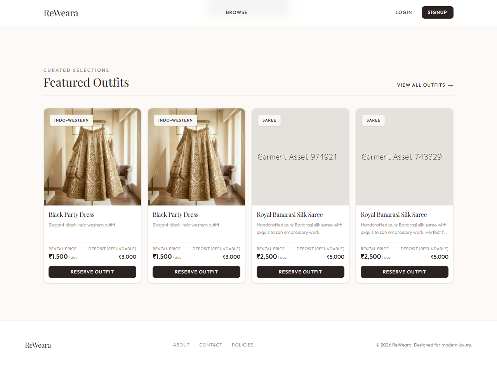
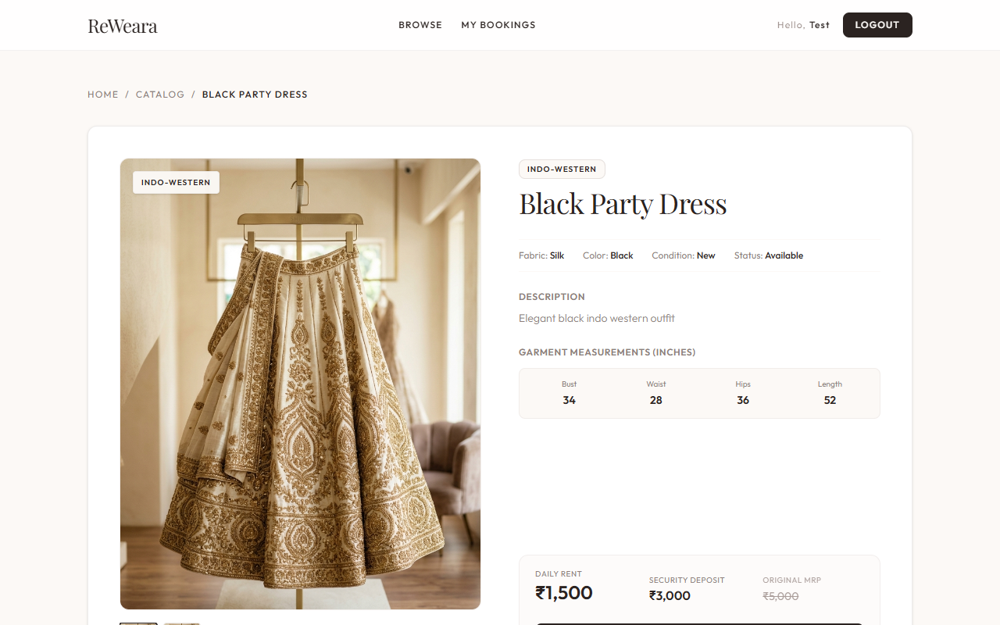

# ReWeara — The Outfit Baar ✨

ReWeara is a premium, fashion-tech rental platform for luxury Indian wedding outfit rentals. Designed to bring an elegant, Pinterest-inspired luxury boutique experience to outfit rentals, it provides high-end designer garments (Lehengas, Gowns, Sarees) at a fraction of their retail price, backed by a production-ready, highly secure full-stack architecture.

*   **Live Demo:** [reweara-sable.vercel.app](https://reweara-sable.vercel.app)
*   **Backend API:** [reweara-backend.vercel.app](https://reweara-backend.vercel.app)

---

## 📸 Interface Showroom

<table width="100%">
  <!-- Row 1: Admin Management Dashboards -->
  <tr>
    <td width="50%" align="center" valign="top">
      <strong>📊 Admin Bookings Dashboard</strong><br/><br/>
      
    </td>
    <td width="50%" align="center" valign="top">
      <strong>🛍️ Admin Outfits Management List</strong><br/><br/>
      
    </td>
  </tr>
  <!-- Row 2: Customer Curation & Booking Checkout -->
  <tr>
    <td width="50%" align="center" valign="top">
      <strong>✨ Customer Collection Curation</strong><br/><br/>
      
    </td>
    <td width="50%" align="center" valign="top">
      <strong>📅 Detailed Outfit Checkout Flow</strong><br/><br/>
      
    </td>
  </tr>
</table>

---

## ⚡ Core Engineering Features

### 🔐 1. Fraud-Prevention & Email Validation Pipeline
- **Real-Time Deliverability Filtering:** Integrates **AbstractAPI Email Reputation API** with a 3-second timeout fallback to automatically block disposable (e.g., *mailinator.com*), fake, or high-risk email domains before account creation.
- **Bcrypt-Hashed OTP Verification:** Dispatches secure 6-digit OTP codes via **Nodemailer** SMTP (Gmail App Passwords) with 15-minute MongoDB TTL auto-expirations, 5-attempt lockout thresholds, and rate-limiting limits (max 3/10min).

### 🔄 2. JWT Session Security & Rotation
- **Token Rotation & Grace Window:** Implements True Refresh Token Rotation (RTR) with a 30-second grace window to prevent race conditions during multi-tab refresh requests.
- **SUSPECT Hijack Detection:** Automatically invalidates all active sessions for a user if a rotated refresh token is reused, mitigating session hijacking.

### 🔒 3. Concurrency-Safe Booking Engine
- **TTL-Based Inventory Holds:** Reserves garments for 15 minutes during checkout via a MongoDB TTL index, preventing double-bookings. Auto-releases holds instantly on payment failure/abandonment without resource-heavy cron polling.
- **Indexed Range Scans:** Compares dates against confirmed bookings using a compound index `{ outfit: 1, bookingStatus: 1, startDate: 1, endDate: 1 }` for sub-millisecond overlap evaluations.
- **2-Day Cleaning Buffer:** Dynamically appends a 2-day sanitization period after every booking to ensure return-log logistics are handled safely.

### 💳 4. Hardened Payment Gateways
- **Signature Authenticity:** Validates webhook signatures from Razorpay via `crypto.timingSafeEqual` to prevent side-channel timing attacks.
- **Fault-Tolerant Refunds:** Implements automated, IDOR-protected, database-logged gateway refund workflows for cancelled bookings.

---

## 🏗️ Decoupled System Architecture

```
reweara/
├── backend/                  # Express.js REST API
│   ├── src/
│   │   ├── config/           # Database, SMTP mailer, & Zod env schemas
│   │   ├── controllers/      # Route logic handlers (auth, bookings, reviews)
│   │   ├── middleware/       # JWT auth guards, rate limiters, error handlers
│   │   ├── models/           # Mongoose schemas (User, Outfit, Booking, OtpVerification)
│   │   └── routes/           # REST router mappings
│   └── tests/                # Jest integration suites (21/21 passed)
└── frontend/                 # React SPA (Vite + Vanilla CSS)
    └── src/
        ├── context/          # React Auth & Booking Contexts
        └── pages/            # Routed pages & Admin dashboards
```

---

## ⚙️ Quick Start & Installation

### 1. Backend Setup
1. Navigate to `/backend`.
2. Configure `.env` based on `.env.example`:
   ```env
   PORT=5000
   NODE_ENV=development
   MONGODB_URI=mongodb+srv://<username>:<password>@cluster.mongodb.net/reweara
   JWT_SECRET=your_jwt_access_secret_hash_key_here_32_characters
   REFRESH_SECRET=your_jwt_refresh_secret_hash_key_here_64_characters
   RAZORPAY_KEY_ID=rzp_test_yourKeyId
   RAZORPAY_SECRET=yourRazorpaySecret
   CLOUDINARY_CLOUD_NAME=yourCloudName
   CLOUDINARY_API_KEY=yourApiKey
   CLOUDINARY_API_SECRET=yourApiSecret
   ABSTRACT_EMAIL_API_KEY=yourAbstractAPIKey
   SMTP_HOST=smtp.gmail.com
   SMTP_PORT=587
   SMTP_USER=your_gmail@gmail.com
   SMTP_PASS=your_gmail_app_password
   ```
3. Install dependencies and seed the initial super_admin user:
   ```bash
   npm install
   npm run seed
   ```
4. Start server: `npm run dev`

### 2. Frontend Setup
1. Navigate to `/frontend`.
2. Install dependencies: `npm install`
3. Start development server: `npm run dev`
